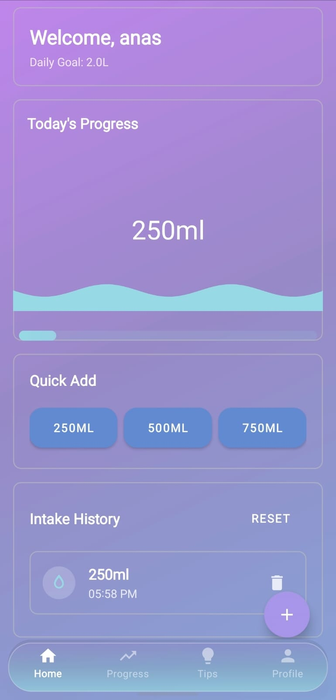
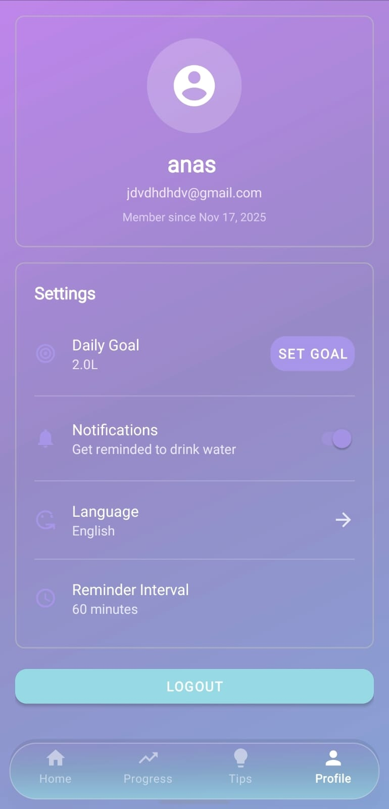
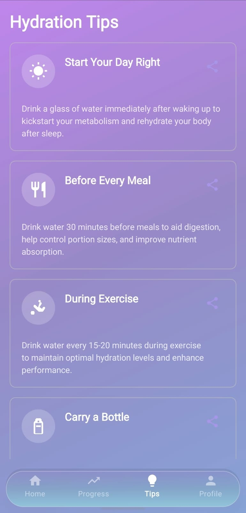

# 💧 Hydration Tracker

A modern Android application designed to help users maintain optimal hydration levels throughout the day. Track daily water intake, receive intelligent reminders, monitor progress, and achieve personalized hydration goals.

## 📋 Table of Contents

- [Features](#features)
- [Screenshots](#screenshots)
- [Tech Stack](#tech-stack)
- [Architecture](#architecture)
- [Project Structure](#project-structure)
- [Getting Started](#getting-started)
- [Installation](#installation)
- [Building the Project](#building-the-project)
- [Key Components](#key-components)
- [Dependencies](#dependencies)
- [License](#license)

## ✨ Features

- **User Authentication**: Secure login and registration system
- **Water Intake Tracking**: Log water consumption with quick-add buttons
- **Daily Goals**: Set personalized daily hydration targets
- **Smart Reminders**: Scheduled notifications via WorkManager to remind users to drink water
- **Progress Visualization**: View daily, weekly, and monthly hydration statistics with charts
- **Intake History**: Review all water intake entries with timestamps
- **Warning System**: Intelligent alerts when approaching daily water limits
- **Multi-language Support**: Localization with language preferences
- **User Profiles**: Manage personal information and preferences
- **Tips & Educational Content**: Access hydration tips and health information
- **Data Persistence**: Local SQLite database with Room ORM
- **Material Design 3**: Modern and intuitive user interface

## 📸 Screenshots

### Main Screens

| Splash | Login | Home |
|------|------|------|
|  |  |  |

### App Features

| Water Logging | Progress Charts | Profile |
|--------------|----------------|---------|
|  |  |  |

## 🛠️ Tech Stack

### Architecture & Design Patterns
- **MVVM** (Model-View-ViewModel) - Clean separation of concerns
- **Repository Pattern** - Data access abstraction layer
- **Dependency Injection** - Hilt for managing dependencies

### Core Technologies
- **Language**: Kotlin
- **Minimum SDK**: 26 (Android 8.0)
- **Target SDK**: 34 (Android 14)
- **Compile SDK**: 34

### Libraries & Frameworks

**Android Framework**
- AndroidX Core KTX
- AppCompat
- Constraint Layout
- Material Design 3

**Architecture**
- Hilt (Dependency Injection)
- Navigation Component
- LiveData & ViewModel (Lifecycle)
- Coroutines (Asynchronous programming)

**Database**
- Room (SQLite ORM)
- DataStore (Preferences)

**Networking**
- Retrofit 2
- OkHttp 3 (HTTP Client)
- Gson (JSON Serialization)

**UI Components**
- MPAndroidChart (Data visualization)
- Lottie (Animations)
- Material Components

**Background Tasks**
- WorkManager (Scheduled tasks & reminders)

**Testing**
- JUnit 4
- Espresso (UI Testing)
- AndroidX Test

## 🏗️ Architecture

This project follows the MVVM architecture pattern with clear separation of concerns:

```
┌─────────────────────────────────────────┐
│          User Interface (UI)             │
│   Activities, Fragments, ViewModels     │
└──────────────┬──────────────────────────┘
               │
┌──────────────▼──────────────────────────┐
│         Domain Layer (Use Cases)         │
│    Business logic & domain models       │
└──────────────┬──────────────────────────┘
               │
┌──────────────▼──────────────────────────┐
│    Repository Pattern & Data Sources    │
│  - Local Database (Room)                │
│  - User Preferences (DataStore)         │
│  - Remote API (Retrofit)                │
└──────────────────────────────────────────┘
```

**Benefits of this architecture:**
- **Testability**: Each layer can be tested independently
- **Maintainability**: Clear responsibility assignment
- **Scalability**: Easy to add new features without affecting existing code
- **Reusability**: Repositories and use cases can be reused across the app

## 📁 Project Structure

```
hydrationtracker/
├── app/
│   ├── src/
│   │   ├── main/
│   │   │   ├── java/com/hydration/tracker/
│   │   │   │   ├── data/                          # Data layer
│   │   │   │   │   ├── local/
│   │   │   │   │   │   ├── entities/              # Room entities
│   │   │   │   │   │   ├── dao/                   # Data Access Objects
│   │   │   │   │   │   └── HydrationDatabase.kt
│   │   │   │   │   ├── preferences/               # SharedPreferences
│   │   │   │   │   └── repository/                # Repository implementations
│   │   │   │   ├── domain/                        # Domain layer
│   │   │   │   │   ├── model/                     # Domain models
│   │   │   │   │   └── usecase/                   # Business logic
│   │   │   │   ├── ui/                            # Presentation layer
│   │   │   │   │   ├── auth/                      # Authentication (Login, SignUp)
│   │   │   │   │   ├── home/                      # Home screen (water tracking)
│   │   │   │   │   ├── progress/                  # Progress & statistics
│   │   │   │   │   ├── profile/                   # User profile
│   │   │   │   │   ├── tips/                      # Tips & information
│   │   │   │   │   ├── components/                # Reusable UI components
│   │   │   │   │   └── MainActivity.kt
│   │   │   │   ├── worker/                        # Background tasks (WorkManager)
│   │   │   │   ├── di/                            # Dependency injection modules
│   │   │   │   ├── utils/                         # Utility functions
│   │   │   │   └── HydrationApp.kt
│   │   │   └── res/                               # Resources (layouts, strings, drawables)
│   │   ├── androidTest/                           # UI tests
│   │   └── test/                                  # Unit tests
│   ├── build.gradle.kts                           # App-level build configuration
│   ├── proguard-rules.pro                         # ProGuard rules
│   └── schemas/                                   # Room database schemas
├── gradle/
│   └── libs.versions.toml                         # Dependency versions
├── build.gradle.kts                               # Root build configuration
├── settings.gradle.kts                            # Project settings
└── README.md
```

### Entity Relationships

**User Entity**
- Stores user account information
- Linked with water intake and goals

**Water Intake Entity**
- Records each water consumption event
- Includes timestamp and volume amount
- References User through foreign key

**Goal Entity**
- Stores user's daily hydration target
- Defines warning and maximum limits

## 🚀 Getting Started

### Prerequisites

- **Android Studio**: Latest stable version (Giraffe or newer)
- **JDK**: Java 17 or higher
- **Android SDK**: API level 26 (minimum) to 34 (recommended)
- **Gradle**: 8.2.2 or later (included via wrapper)

### Installation

1. **Clone the repository**
   ```bash
   git clone https://github.com/yourusername/hydrationtracker.git
   cd hydrationtracker
   ```

2. **Open in Android Studio**
   - Launch Android Studio
   - Select "Open an existing Android Studio project"
   - Navigate to the project directory and click "Open"

3. **Configure SDK (if needed)**
   - File → Project Structure → SDK Location
   - Ensure you have the required Android SDK versions installed

4. **Sync Gradle Files**
   - Android Studio will automatically sync dependencies
   - If not, use Build → Make Project

## 🔨 Building the Project

### Debug Build
```bash
# Using Gradle wrapper (Windows)
./gradlew assembleDebug

# Or in Android Studio
Build → Build Bundle(s) / APK(s) → Build APK(s)
```

### Release Build
```bash
# Using Gradle wrapper
./gradlew assembleRelease

# The APK will be generated at:
# app/build/outputs/apk/release/app-release-unsigned.apk
```

### Running Tests
```bash
# Unit tests
./gradlew test

# Instrumented tests (requires connected device/emulator)
./gradlew connectedAndroidTest
```

## 🔑 Key Components

### Activities
- **SplashActivity**: App launch screen with branding
- **LoginActivity**: User authentication screen
- **SignUpActivity**: New user registration
- **MainActivity**: Primary app container with navigation

### Fragments
- **HomeFragment**: Main water tracking interface
- **ProgressFragment**: Statistics and chart visualization
- **ProfileFragment**: User information management
- **TipsFragment**: Health and hydration tips

### ViewModels
- **AuthViewModel**: Handles authentication logic
- **HomeViewModel**: Manages water intake data and user interactions
- **ProgressViewModel**: Processes and displays statistics

### Database
- **HydrationDatabase**: Room database configuration
- **UserDao**: User data operations
- **WaterIntakeDao**: Water intake CRUD operations
- **GoalDao**: Hydration goal management

### Background Services
- **ReminderWorker**: Scheduled notifications via WorkManager
- **HydrationApp**: Application initialization and notification channels

## 📦 Dependencies

### Core Libraries
| Library | Version | Purpose |
|---------|---------|---------|
| AndroidX Core | 1.12.0 | Core Android functionality |
| AppCompat | 1.6.1 | Backward compatibility |
| Material Design | 1.11.0 | Material Design components |
| Constraint Layout | 2.1.4 | Layout system |

### Architecture
| Library | Version | Purpose |
|---------|---------|---------|
| Lifecycle | 2.7.0 | ViewModel & LiveData |
| Navigation | 2.7.6 | Fragment navigation |
| Room | 2.6.1 | Local database |
| Hilt | 2.48.1 | Dependency injection |
| WorkManager | 2.9.0 | Background scheduling |

### Data & Networking
| Library | Version | Purpose |
|---------|---------|---------|
| Retrofit | 2.9.0 | REST client |
| OkHttp | 4.12.0 | HTTP client |
| Gson | Latest | JSON parsing |

### UI & Visualization
| Library | Version | Purpose |
|---------|---------|---------|
| MPAndroidChart | 3.1.0 | Data charts |
| Lottie | 6.2.0 | Animations |
| Coroutines | 1.7.3 | Async operations |

## 🔐 Permissions

The app requires the following permissions:

```xml
<uses-permission android:name="android.permission.INTERNET" />
<uses-permission android:name="android.permission.POST_NOTIFICATIONS" />
<uses-permission android:name="android.permission.SCHEDULE_EXACT_ALARM" />
<uses-permission android:name="android.permission.USE_EXACT_ALARM" />
<uses-permission android:name="android.permission.WAKE_LOCK" />
<uses-permission android:name="android.permission.RECEIVE_BOOT_COMPLETED" />
```

**Permission Purposes:**
- `INTERNET`: Remote API communication
- `POST_NOTIFICATIONS`: Reminder notifications
- `SCHEDULE_EXACT_ALARM`: Precise reminder scheduling
- `WAKE_LOCK`: Background reminder execution
- `RECEIVE_BOOT_COMPLETED`: Restore reminders after device restart

## 🧪 Testing

The project includes comprehensive testing infrastructure:

- **Unit Tests**: Located in `app/src/test/`
- **Instrumented Tests**: Located in `app/src/androidTest/`
- **Test Runner**: AndroidJUnitRunner

Run tests with:
```bash
# All tests
./gradlew test connectedAndroidTest

# Specific test class
./gradlew test -Dtest.single=YourTestClass
```

## 📱 Supported Platforms

- **Minimum Android Version**: Android 8.0 (API 26)
- **Target Android Version**: Android 14 (API 34)
- **Screen Sizes**: Phone and Tablet (responsive design)
- **Orientations**: Portrait primary (configurable per activity)

## 🎨 UI/UX Features

- **Material Design 3**: Modern, clean interface
- **Dark Mode Support**: System theme adaptation
- **Responsive Layouts**: Optimal viewing on all screen sizes
- **Smooth Animations**: Lottie-powered transition effects
- **Accessibility**: Material Design compliance

## 🐛 Debugging

Enable advanced debugging features:

1. **Logcat Filtering**
   ```
   Package filter: com.hydration.tracker
   ```

2. **Database Inspection**
   - Use Android Studio's Database Inspector
   - Navigate to View → Tool Windows → Database Inspector

3. **Network Inspection**
   - Enable OkHttp logging interceptor in debug builds
   - Use Android Studio's Network Profiler

## 📝 Changelog

### Version 1.0 (Initial Release)
- User authentication system
- Water intake tracking
- Daily goal management
- Progress visualization
- Push notifications and reminders
- Multi-language support
- User profile management

## 🤝 Contributing

This project is part of a junior Android developer portfolio. While not currently accepting external contributions, feel free to fork and customize for your own use.

## 📄 License

This project is provided as-is for educational and portfolio purposes.

## 👨‍💻 About the Developer

This project showcases proficiency in:
- Modern Android Development (Kotlin)
- MVVM Architecture
- Dependency Injection (Hilt)
- Room Database
- Navigation Component
- LiveData & Coroutines
- WorkManager
- Material Design
- RESTful API Integration

## 📞 Contact

For questions or feedback, please reach out through your preferred contact method.

---

**Last Updated**: February 2026

Made with 💧 for hydration enthusiasts
